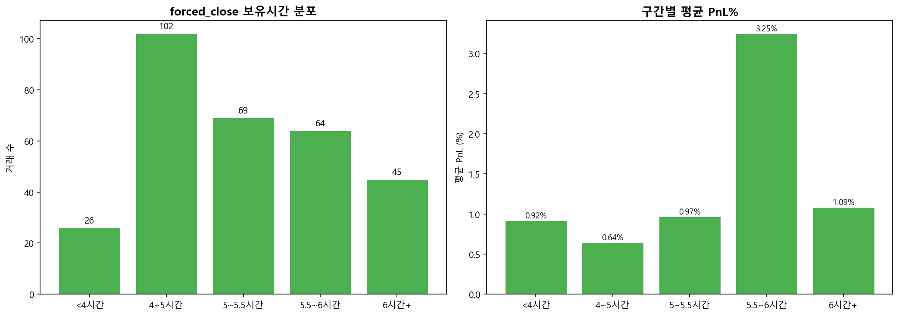
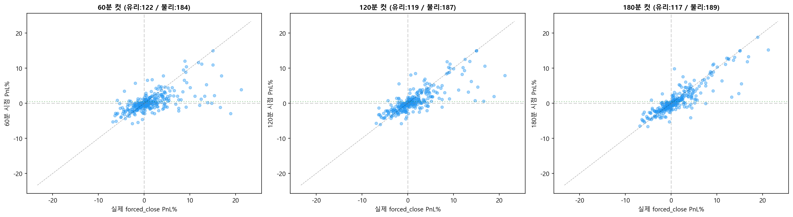
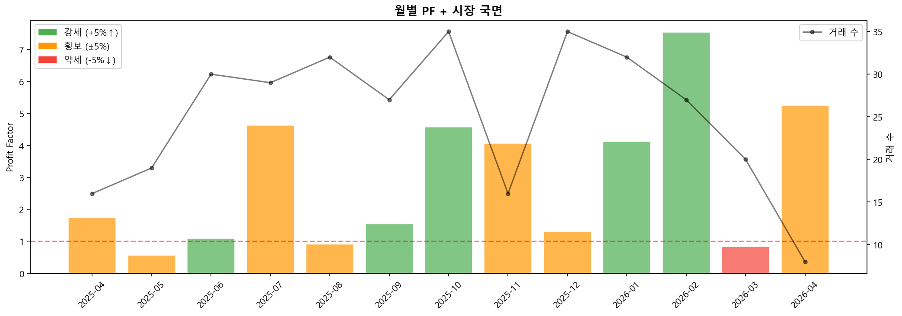
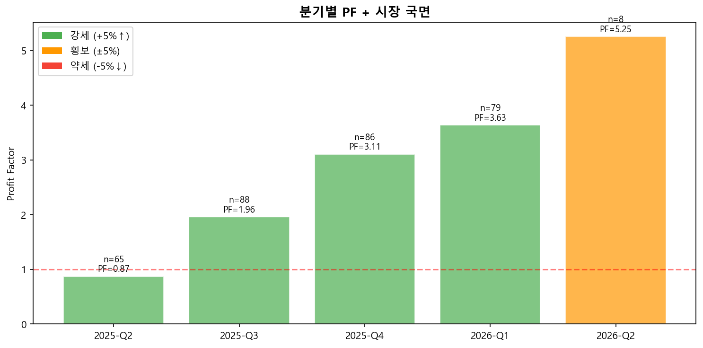
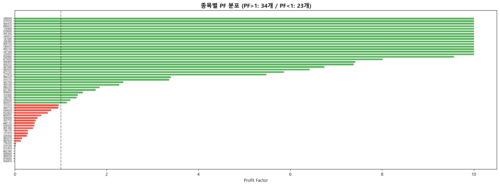
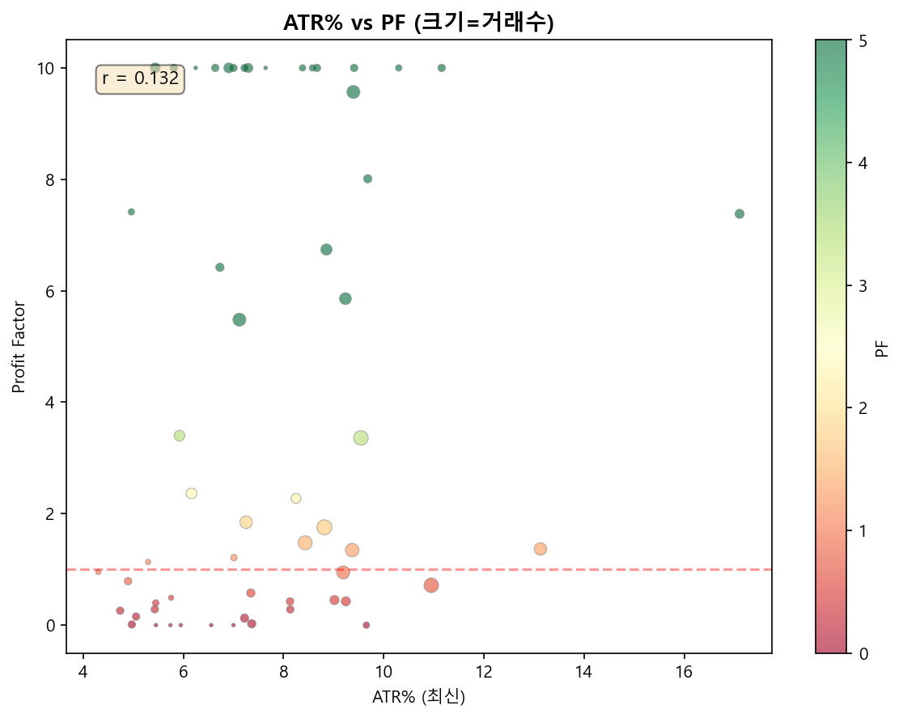
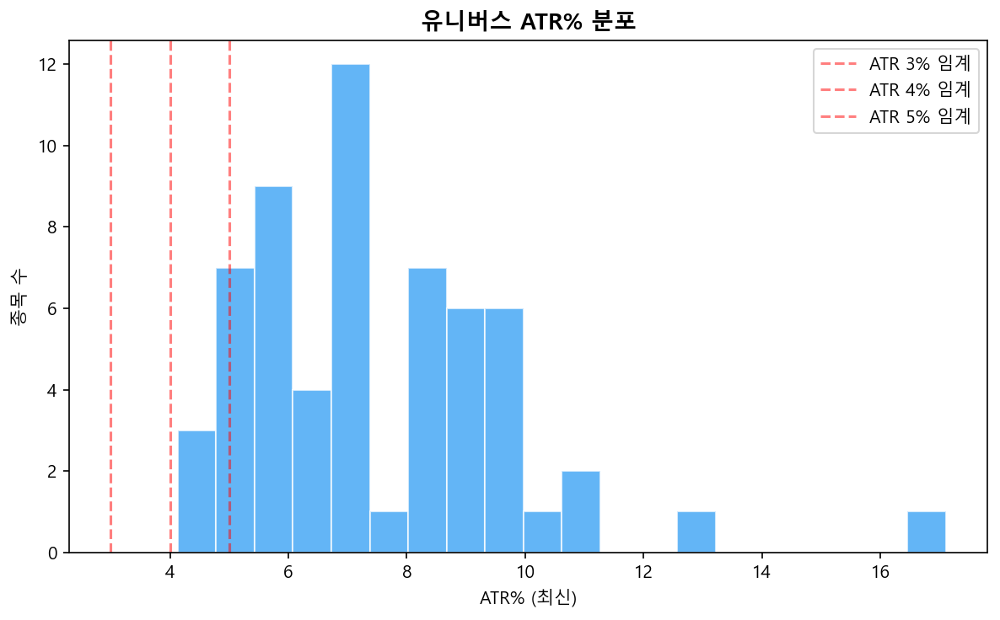
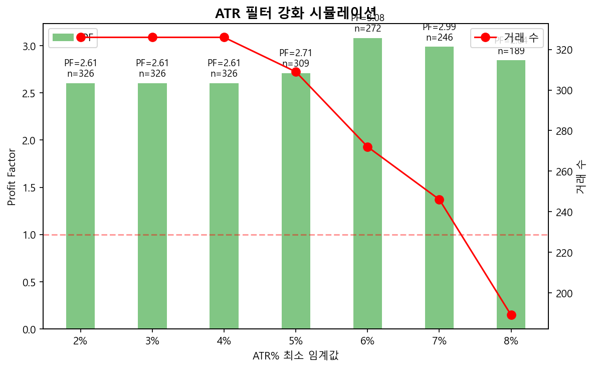

# Baseline 종합 분석 보고서

> 생성: 2026-04-16 11:53
> 총 거래: 326건 / PF: 2.61

---

## 1. 자리 점유 분석

**가설**: forced_close 306건 중 상당수가 60분+ 보유하며 +0.5% 미달 → 자리만 차지

### 보유시간 분포

| 구간 | 거래수 | 비율 | 평균 PnL% |
|------|--------|------|-----------|
| <4시간 | 26 | 8.5% | +0.918% |
| 4~5시간 | 102 | 33.3% | +0.644% |
| 5~5.5시간 | 69 | 22.5% | +0.969% |
| 5.5~6시간 | 64 | 20.9% | +3.249% |
| 6시간+ | 45 | 14.7% | +1.086% |

### 자리 점유 비율

- forced_close 중 PnL < +0.5%: **159건 / 306건 (52.0%)**
- 해당 거래 평균 PnL: -930.0원
- 참고: 진입 09:05~12:00, 청산 15:10 → 전체 forced_close 보유시간 190~370분

### 시점별 time_stop 시뮬레이션

| 시점 | 조회 | 컷이 유리 | 컷이 불리 | 평균 PnL% 차이 | 놓친 수익 비율 |
|------|------|----------|----------|---------------|--------------|
| 60분 | 306건 | 122건 | 184건 | -1.0283% | 102건 (33.3%) |
| 120분 | 306건 | 119건 | 187건 | -0.6892% | 115건 (37.6%) |
| 180분 | 306건 | 117건 | 189건 | -0.4617% | 125건 (40.8%) |

- **놓친 수익**: 해당 시점에 PnL≥+0.5%였지만 결국 forced_close로 하락한 거래 비율
- **평균 차이 > 0**: 해당 시점 컷이 평균적으로 유리, **< 0**: 끝까지 보유가 유리

**가설 판정**: **모호** — 자리 점유 52%이나 60분 컷은 평균 불리(-1.028%). 120분 컷 효과: -0.689%

---

## 2. 시장 국면별 PF 분해

**가설**: 강세장에서만 수익이 나고 약세장에서는 손실 → 강세장 편향 시스템

### 월별 집계

| 월 | 국면 | 거래수 | PF | PnL | KOSPI | KOSDAQ |
|-----|------|--------|-----|------|-------|--------|
| 2025-04 | 횡보 | 16 | 1.73 | +2,834 | +1.4% | +3.7% |
| 2025-05 | 횡보 | 19 | 0.57 | -9,821 | +5.4% | +1.7% |
| 2025-06 | 강세 | 30 | 1.09 | +1,447 | +13.8% | +5.6% |
| 2025-07 | 횡보 | 29 | 4.63 | +28,838 | +5.0% | +2.8% |
| 2025-08 | 횡보 | 32 | 0.91 | -1,222 | +2.1% | +3.1% |
| 2025-09 | 강세 | 27 | 1.55 | +9,282 | +9.0% | +7.3% |
| 2025-10 | 강세 | 35 | 4.58 | +62,332 | +18.9% | +6.5% |
| 2025-11 | 횡보 | 16 | 4.06 | +30,873 | -7.0% | -0.2% |
| 2025-12 | 횡보 | 35 | 1.30 | +5,842 | +7.5% | +0.3% |
| 2026-01 | 강세 | 32 | 4.12 | +58,513 | +21.2% | +21.6% |
| 2026-02 | 강세 | 27 | 7.55 | +131,431 | +26.2% | +8.6% |
| 2026-03 | 약세 | 20 | 0.83 | -5,214 | -12.8% | -7.5% |
| 2026-04 | 횡보 | 8 | 5.25 | +6,540 | +6.9% | -2.0% |

### 분기별 집계

| 분기 | 국면 | 거래수 | PF | PnL |
|------|------|--------|-----|------|
| 2025-Q2 | 강세 | 65 | 0.87 | -5,540 |
| 2025-Q3 | 강세 | 88 | 1.96 | +36,897 |
| 2025-Q4 | 강세 | 86 | 3.11 | +99,047 |
| 2026-Q1 | 강세 | 79 | 3.63 | +184,729 |
| 2026-Q2 | 횡보 | 8 | 5.25 | +6,540 |

### 국면별 요약

| 국면 | 거래수 | PF | 총 PnL |
|------|--------|-----|--------|
| 강세 | 151 | 3.93 | +263,004 |
| 횡보 | 155 | 1.81 | +63,883 |
| 약세 | 20 | 0.83 | -5,214 |

**가설 판정**: **참** — 약세 PF=0.83 / 강세 PF=3.93, 강세장 편향

---

## 3. 종목별 PF 편차

**가설**: PF<1 종목이 전체 수익률을 끌어내림

- 전체 PF: **2.61**
- PF>1 종목: **34개**
- PF<1 종목: **23개**
- PF<0.5 종목: **18개**
- PF<1 종목 제외 시 PF: **4.79** (229건)

### ATR% vs 수익성

- PF>1 종목 평균 ATR%: **8.21%**
- PF<1 종목 평균 ATR%: **6.85%**
- 차이: **+1.35%p** → ATR이 높은 종목이 수익성 우수

### 상위 10 종목 (PF 기준)

| 종목 | 거래수 | PF | PnL | ATR% |
|------|--------|-----|------|------|
| 298380 | 4 | ∞ | +13,839 | 6.6% |
| 141080 | 3 | ∞ | +16,788 | 8.4% |
| 240810 | 4 | ∞ | +1,029 | 7.0% |
| 095340 | 3 | ∞ | +7,048 | 10.3% |
| 078600 | 6 | ∞ | +13,875 | 7.3% |
| 174900 | 4 | ∞ | +1,050 | 11.2% |
| 490470 | 3 | ∞ | +4,992 | 8.6% |
| 066970 | 7 | ∞ | +14,061 | 6.9% |
| 079550 | 1 | ∞ | +1,253 | 7.6% |
| 298040 | 1 | ∞ | +3,917 | 6.2% |

### 하위 10 종목 (PF 기준)

| 종목 | 거래수 | PF | PnL | ATR% |
|------|--------|-----|------|------|
| 000270 | 4 | 0.15 | -4,360 | 5.1% |
| 082920 | 5 | 0.13 | -2,824 | 7.2% |
| 178320 | 5 | 0.02 | -4,123 | 7.4% |
| 010140 | 4 | 0.01 | -317 | 5.0% |
| 058470 | 1 | 0.00 | -1,565 | 5.9% |
| 476830 | 3 | 0.00 | -15,008 | 9.7% |
| 089030 | 1 | 0.00 | -1,656 | 7.0% |
| 000660 | 1 | 0.00 | -1,424 | 5.7% |
| 402340 | 1 | 0.00 | -4,573 | 6.6% |
| 012450 | 1 | 0.00 | -276 | 5.5% |

**가설 판정**: **참** — PF<1 종목 제거 시 PF +2.18 개선, 유니버스 정제 효과 있음

---

## 4. ATR 필터 적정성

**가설**: ATR 필터를 강화하면 저변동성 종목 제거로 PF 개선

> **한계**: 시점별 ATR 변동이 있으나 최신 ATR%로 일괄 적용하여 시뮬. 과거 시점의 ATR%는 현재와 다를 수 있음.

| ATR 임계 | 남은 종목 | 거래수 | PF | 총 PnL | 거래당 PnL |
|----------|----------|--------|-----|--------|-----------|
| ≥2% | 60/60 | 326 | 2.61 | +321,673 | +987 |
| ≥3% | 60/60 | 326 | 2.61 | +321,673 | +987 |
| ≥4% | 60/60 | 326 | 2.61 | +321,673 | +987 |
| ≥5% | 53/60 | 309 | 2.71 | +310,805 | +1,006 |
| ≥6% | 41/60 | 272 | 3.08 | +292,151 | +1,074 |
| ≥7% | 35/60 | 246 | 2.99 | +242,021 | +984 |
| ≥8% | 24/60 | 189 | 2.84 | +144,420 | +764 |

**최적 임계값**: ATR ≥ 6% (거래당 PnL 기준, 거래수 272건)

---

## 종합 권장 사항

| 가설 | 판정 | 권장 액션 |
|------|------|----------|
| 자리 점유 | 52% | time_stop 120~180분 구간 테스트 (60분은 역효과) |
| 강세장 편향 | bull PF=3.9 / bear PF=0.8(20건) | 약세장 방어 필터 강화 (시장 MA 10일 등) |
| 종목 PF 편차 | ΔPF=+2.18 | PF<1 하위 23종목 검토, 유니버스 정제 |
| ATR 필터 | 최적 6% | 해당 임계값으로 backtest 재검증 |
