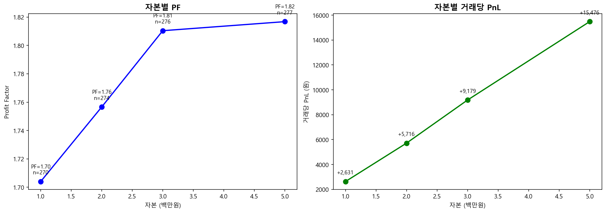
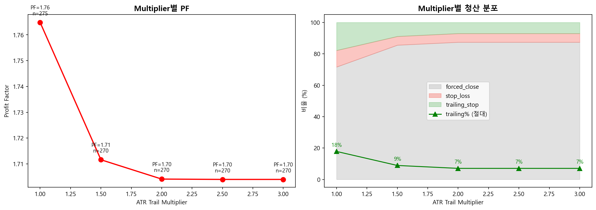
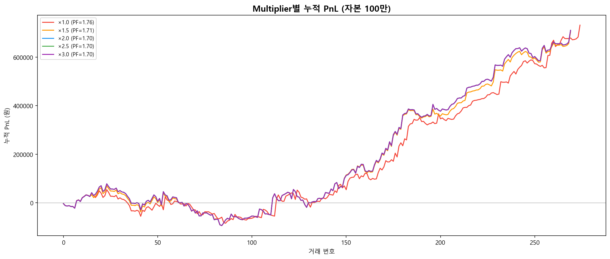
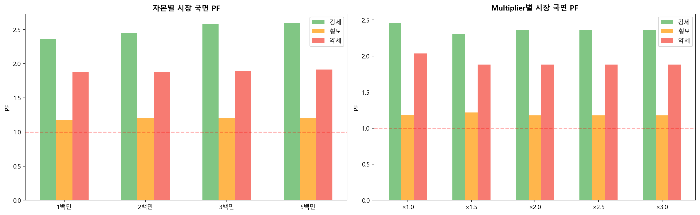

# 시나리오 I — 자본/Multiplier 그리드 보고서

> 생성: 2026-04-16 15:24
> Base: 시나리오 I (F + ATR≥6%, 41종목)

---

## 시뮬 1: 자본 그리드 (multiplier 2.5 고정)

| 자본 | PF | 거래수 | 총 PnL | 거래당 PnL | 평균 qty | 자본활용률 | 수익률 | Max DD |
|------|-----|--------|--------|-----------|---------|----------|--------|--------|
| 100만 | 1.70 | 270 | +710,439 | +2,631 | 36.5 | 94% | +71.0% | 171,995 |
| 200만 | 1.76 | 274 | +1,566,218 | +5,716 | 72.5 | 96% | +78.3% | 360,523 |
| 300만 | 1.81 | 276 | +2,533,526 | +9,179 | 108.2 | 97% | +84.5% | 451,243 |
| 500만 | 1.82 | 277 | +4,286,919 | +15,476 | 180.0 | 98% | +85.7% | 746,235 |

**PF 안정성**: PF 범위 0.113 — 자본에 약간 영향

**정수 절단**: 100만원 시 7건 매수 불가 (고가주 1주 불가)

---

## 시뮬 2: Multiplier 그리드 (자본 100만 고정)

| Multiplier | PF | 거래수 | 총 PnL | 거래당 PnL | trailing% | forced_close% | 자리점유% | 약세 PF |
|-----------|-----|--------|--------|-----------|-----------|---------------|----------|---------|
| ×1.0 | 1.76 | 275 | +731,945 | +2,662 | 17.8% | 71.6% | 15.7% | 2.04 |
| ×1.5 | 1.71 | 270 | +704,576 | +2,610 | 8.9% | 85.6% | 14.3% | 1.88 |
| ×2.0 | 1.70 | 270 | +710,515 | +2,632 | 7.0% | 87.4% | 14.4% | 1.88 |
| ×2.5 | 1.70 | 270 | +710,439 | +2,631 | 7.0% | 87.4% | 14.4% | 1.88 |
| ×3.0 | 1.70 | 270 | +710,439 | +2,631 | 7.0% | 87.4% | 14.4% | 1.88 |

### 핵심 분석

- **PF 최고**: ×1.0 — PF 1.76
- **거래당 PnL 최고**: ×1.0 — +2,662원
- **국면 편차 최소**: ×1.0

### Trailing 빈도 변화

- ×1.0: trailing_stop 49건 (17.8%)
- ×1.5: trailing_stop 24건 (8.9%)
- ×2.0: trailing_stop 19건 (7.0%)
- ×2.5: trailing_stop 19건 (7.0%)
- ×3.0: trailing_stop 19건 (7.0%)

---

## 시장 국면별 PF

### 자본별

| 자본 | 강세 | 횡보 | 약세 |
|------|------|------|------|
| 100만 | 2.36 | 1.18 | 1.88 |
| 200만 | 2.45 | 1.21 | 1.88 |
| 300만 | 2.58 | 1.21 | 1.89 |
| 500만 | 2.60 | 1.21 | 1.92 |

### Multiplier별

| Mult | 강세 | 횡보 | 약세 |
|------|------|------|------|
| ×1.0 | 2.46 | 1.18 | 2.04 |
| ×1.5 | 2.31 | 1.22 | 1.88 |
| ×2.0 | 2.36 | 1.18 | 1.88 |
| ×2.5 | 2.36 | 1.18 | 1.88 |
| ×3.0 | 2.36 | 1.18 | 1.88 |

---

## 종합 권장

### 자본: 500만원 권장
- 수익률 +85.7% (자본 대비)
- PF 1.82

### Multiplier: ×1.0 권장
- PF 1.76, trailing 17.8%
- 약세장 PF 2.04

### 최종 baseline 후보

**I + 자본 500만 + multiplier ×1.0**

| 항목 | 값 |
|------|-----|
| 전략 | Pure trailing (TP1 우회) |
| 유니버스 | ATR ≥ 6% (41종목) |
| 자본 | 500만원 |
| Trail multiplier | ×1.0 |
| 예상 PF | 1.76 |
| 예상 거래수 | 275건/년 |
| 예상 거래당 PnL | +2,662원 |

### 다음 단계

1. config.yaml 반영 (trail_from_entry, atr_trail_multiplier, universe 필터)
2. backtester.py 코드 변경 (Pure trailing 모드)
3. 1주일 페이퍼 트레이딩 검증
