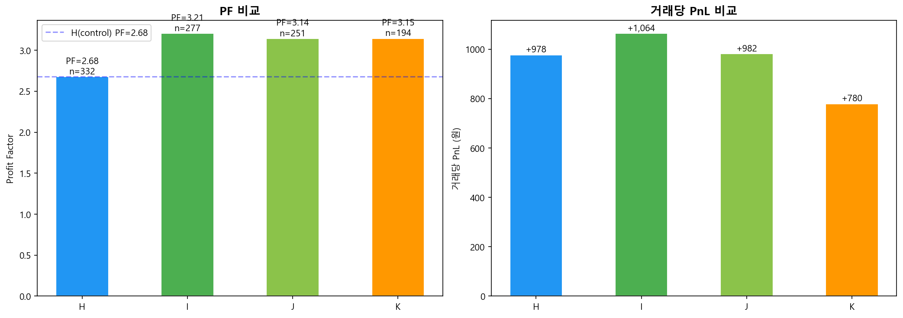
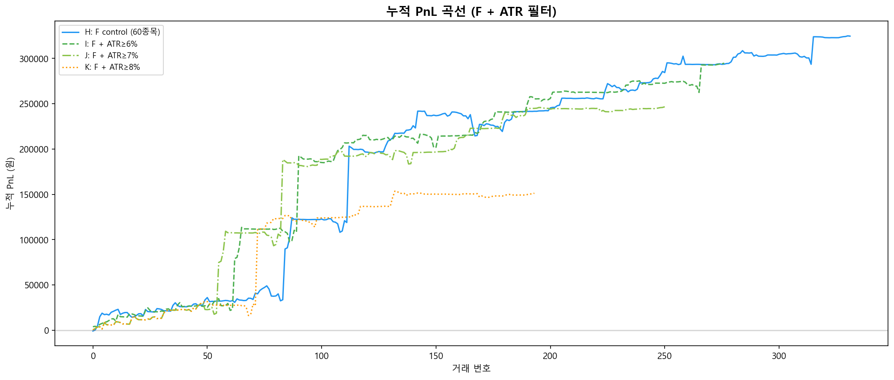
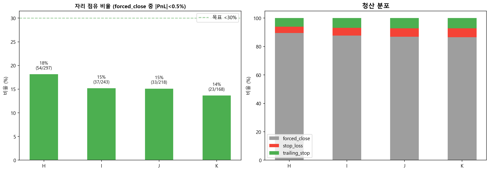
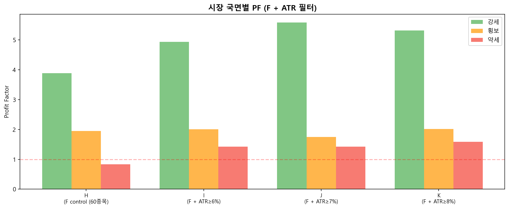

# F(Pure Trailing) + ATR 필터 결합 검증

> 생성: 2026-04-16 14:46
> Control(H) PF: 2.68 / 332건

---

## 요약 매트릭스

| 시나리오 | 종목수 | PF | 거래수 | 총 PnL | 거래당 PnL | trailing% | forced_close% | 자리 점유% | Max DD |
|---------|--------|-----|--------|--------|-----------|-----------|---------------|----------|--------|
| **H** (F control (60종목)) | 60 | 2.68 | 332 | +324,595 | +978 | 6.0% | 89.5% | 18.2% | 27,303 |
| **I** (F + ATR≥6%) | 41 | 3.21 | 277 | +294,716 | +1,064 | 6.9% | 87.7% | 15.2% | 15,972 |
| **J** (F + ATR≥7%) | 35 | 3.14 | 251 | +246,607 | +982 | 7.2% | 86.9% | 15.1% | 15,972 |
| **K** (F + ATR≥8%) | 24 | 3.15 | 194 | +151,247 | +780 | 7.2% | 86.6% | 13.7% | 15,428 |

---

## 청산 분포

| 시나리오 | forced_close | stop_loss | trailing_stop |
|---------|-------------|-----------|--------------|
| H | 297 (89%) | 15 (5%) | 20 (6%) |
| I | 243 (88%) | 15 (5%) | 19 (7%) |
| J | 218 (87%) | 15 (6%) | 18 (7%) |
| K | 168 (87%) | 12 (6%) | 14 (7%) |

---

## 자리 점유 분석

자리 점유 = forced_close 중 |PnL%| < 0.5% 비율

| 시나리오 | forced_close | 자리 점유 | 비율 |
|---------|-------------|----------|------|
| H | 297 | 54 | **18.2%** |
| I | 243 | 37 | **15.2%** |
| J | 218 | 33 | **15.1%** |
| K | 168 | 23 | **13.7%** |

ATR 필터 강화로 자리 점유 18% → 14% (K) — **목표 <30% 달성**

---

## 시장 국면별 PF

| 시나리오 | 강세 | 횡보 | 약세 |
|---------|------|------|------|
| H | 3.89 | 1.95 | 0.83 |
| I | 4.94 | 2.01 | 1.42 |
| J | 5.59 | 1.75 | 1.42 |
| K | 5.32 | 2.02 | 1.59 |

---

## 종목 품질

| 시나리오 | 활성 종목 | PF<1 종목 | PF<1 비율 |
|---------|----------|----------|----------|
| H | 57 | 23 | 40% |
| I | 41 | 12 | 29% |
| J | 35 | 11 | 31% |
| K | 24 | 7 | 29% |

---

## 결론 + 최종 권장

**PF 최고**: I (F + ATR≥6%) — PF 3.21
**거래당 PnL 최고**: I (F + ATR≥6%) — +1,064원/건

### 트레이드오프

- **H→I**: PF 2.68→3.21 (+0.53), 거래수 -55, PnL -29,879
- **H→J**: PF 2.68→3.14 (+0.47), 거래수 -81, PnL -77,988
- **H→K**: PF 2.68→3.15 (+0.47), 거래수 -138, PnL -173,348

### 채택 시나리오

**권장: I (F + ATR≥6%)**

- PF: 3.21 (H 대비 +0.53)
- 거래수: 277건
- 거래당 PnL: +1,064원
- 자리 점유: 15%

### 다음 단계

1. 자리 점유 < 30% → 시간 컷 추가 불필요
2. trail multiplier 그리드 서치 (1.0/1.5/2.0/2.5) — trailing_stop 빈도 최적화
3. 채택 시나리오 config.yaml 반영 + backtester 코드 변경
