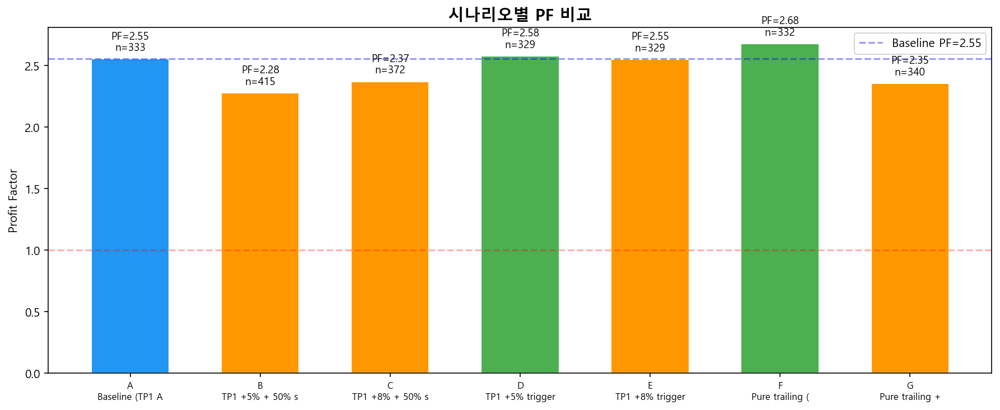
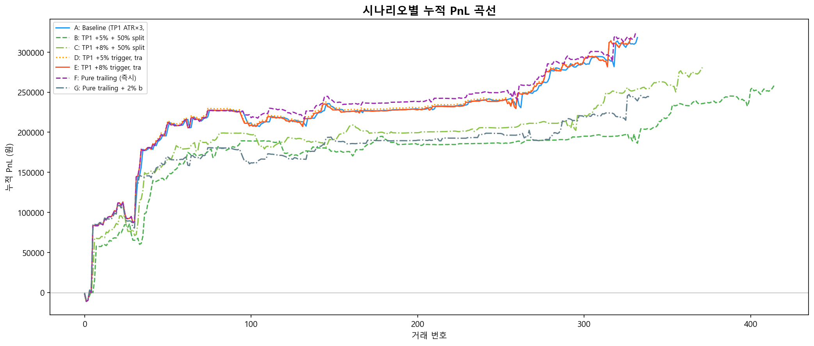
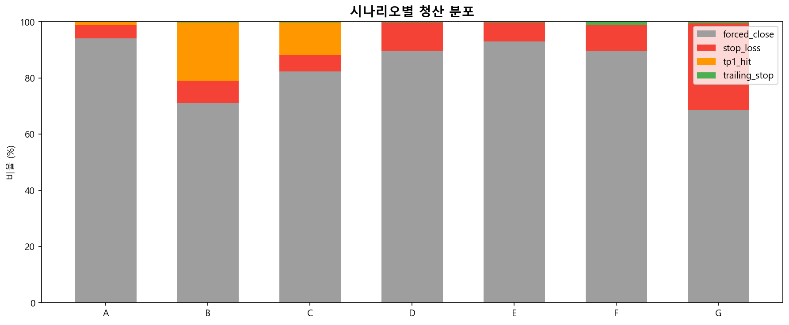
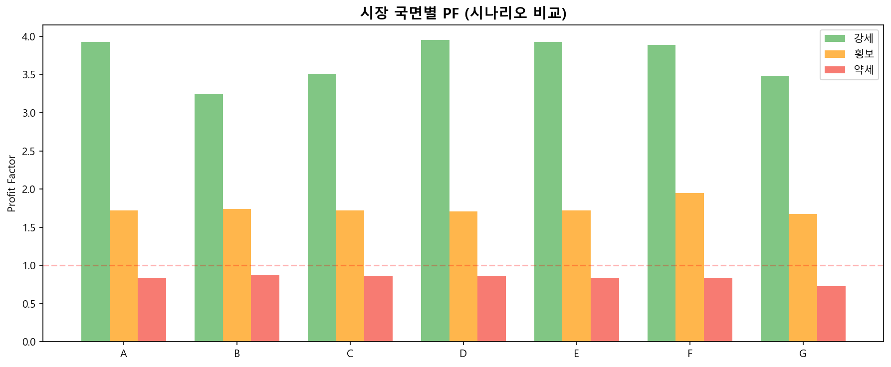

# TP1/Trailing 시나리오 비교 보고서

> 생성: 2026-04-16 14:03
> Baseline PF: 2.55 / 333건

## 시나리오 정의

| ID | 설명 | TP1 | 분할매도 | Trail 시작 | 본전 이동 |
|-----|------|-----|---------|-----------|----------|
| A | Baseline (TP1 ATR×3, 50% split) | ATR×3.0 | 50% | TP1 후 | O |
| B | TP1 +5% + 50% split | +5% | 50% | TP1 후 | O |
| C | TP1 +8% + 50% split | +8% | 50% | TP1 후 | O |
| D | TP1 +5% trigger, trail 100% | +5% | 없음 | TP1 후 | O |
| E | TP1 +8% trigger, trail 100% | +8% | 없음 | TP1 후 | O |
| F | Pure trailing (즉시) | 없음 | 없음 | 진입 즉시 | X |
| G | Pure trailing + 2% buffer | 없음 | 없음 | +2% 도달 | O |

---

## 요약 매트릭스

| 시나리오 | PF | 거래수 | 총 PnL | 거래당 PnL | trailing 활성률 | forced_close% | Max DD |
|---------|-----|--------|--------|-----------|---------------|-------------|--------|
| **A** | 2.55 | 333 | +318,254 | +956 | 1.2% | 94.0% | 25,862 |
| **B** | 2.28 | 415 | +258,203 | +622 | 21.0% | 71.1% | 25,862 |
| **C** | 2.37 | 372 | +280,920 | +755 | 11.8% | 82.3% | 25,862 |
| **D** | 2.58 | 329 | +318,743 | +969 | 0.3% | 89.7% | 25,862 |
| **E** | 2.55 | 329 | +318,058 | +967 | 0.3% | 93.0% | 25,862 |
| **F** | 2.68 | 332 | +324,595 | +978 | 1.2% | 89.5% | 25,862 |
| **G** | 2.35 | 340 | +244,469 | +719 | 0.6% | 68.5% | 29,459 |

---

## 청산 분포 상세

| 시나리오 | forced_close | stop_loss | tp1_hit | trailing_stop |
|---------|-------------|-----------|---------|--------------|
| A | 313 (94%) | 16 (5%) | 4 (1%) | 0 (0%) |
| B | 295 (71%) | 33 (8%) | 86 (21%) | 1 (0%) |
| C | 306 (82%) | 22 (6%) | 43 (12%) | 1 (0%) |
| D | 295 (90%) | 33 (10%) | 0 (0%) | 1 (0%) |
| E | 306 (93%) | 22 (7%) | 0 (0%) | 1 (0%) |
| F | 297 (89%) | 31 (9%) | 0 (0%) | 4 (1%) |
| G | 233 (69%) | 105 (31%) | 0 (0%) | 2 (1%) |

---

## 시장 국면별 PF

| 시나리오 | 강세 | 횡보 | 약세 |
|---------|------|------|------|
| A | 3.93 | 1.72 | 0.83 |
| B | 3.24 | 1.74 | 0.87 |
| C | 3.51 | 1.72 | 0.86 |
| D | 3.96 | 1.71 | 0.87 |
| E | 3.93 | 1.72 | 0.83 |
| F | 3.89 | 1.95 | 0.83 |
| G | 3.48 | 1.68 | 0.73 |

---

## 핵심 비교

### A vs B vs C (TP1 임계값 영향)

- **A→B (ATR×3→+5%)**: PF 2.55 → 2.28 (-0.27), PnL -60,051, 거래당 -334
- **A→C (ATR×3→+8%)**: PF 2.55 → 2.37 (-0.18), PnL -37,334, 거래당 -201

### B vs D, C vs E (분할매도 vs Trailing-only) — 핵심

- **B→D (+5% split→trail)**: PF 2.28 → 2.58 (+0.30), PnL +60,540, 거래당 +347
- **C→E (+8% split→trail)**: PF 2.37 → 2.55 (+0.18), PnL +37,138, 거래당 +212

### D/E vs F/G (TP1 트리거 유무)

- **D→F (trigger→pure trail)**: PF 2.58 → 2.68 (+0.10), PnL +5,851, 거래당 +9
- **E→G (trigger→buffer trail)**: PF 2.55 → 2.35 (-0.20), PnL -73,589, 거래당 -248

### F vs A (가장 극단적 비교)

- **A→F (baseline→pure trail)**: PF 2.55 → 2.68 (+0.12), PnL +6,341, 거래당 +22
- **A→G (baseline→buffer trail)**: PF 2.55 → 2.35 (-0.20), PnL -73,785, 거래당 -237

---

## 결론 + 권장

**PF 최고**: 시나리오 **F** (Pure trailing (즉시)) — PF 2.68, 332건
**거래당 PnL 최고**: 시나리오 **F** (Pure trailing (즉시)) — +978원/건

**사용자 제안 검증 (D: TP1 트리거 + 전량 trailing)**: 분할매도 대비 **PF 개선 확인** — 채택 권장

### 채택 시 코드 변경

시나리오 **F** 채택 시:

- `backtest/backtester.py`: TP1 로직 스킵, trailing 즉시 활성 분기
- `config.yaml`: `tp1_enabled: false`, `trail_from_entry: true`
- 영향 범위: backtester ~30줄 수정
